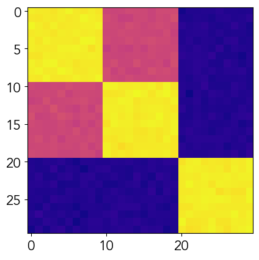

# Task Modulated Functional Connectivity (TMFC) simulator

Task connectomics, based on whole-brain task-modulated functional connectivity (TMFC),
represents a cutting-edge field within neuroscience. It is characterized by numerous
unresolved methodological questions and a lack of universally accepted approaches for
TMFC assessment. 

This package enables users to generate biophysically realistic simulations of 
task-modulated fMRI time series with predefined task designs and 
customized synaptic weight matrices for each condition (task or rest).

Additionally, we have incorporated the ability to simulate co-activations
using box-car functions to evaluate their impact on the spurious inflation of TMFC estimates.

$$\text{Neuronal activity} =\text{ Oscillations (WC model)} + \text{Co-activations (box-car functions)}$$

The package is based on modifications of the Wilson-Cowan model implemented in the [neurolib](https://github.com/neurolib-dev/neurolib) library (see 
[Cakan, C., Jajcay, N. & Obermayer, K. neurolib: A Simulation Framework 
for Whole-Brain Neural Mass Modeling. Cogn. Comput. (2021)](https://doi.org/10.1007/s12559-021-09931-9)). 
The key differences from the neurolib implementation are:

 - The ability to change the synaptic weight matrix over time
 - The option to use synaptic activity as output instead of excitation or inhibition (as described in Horwitz and Tagamets, 1999)
 - The ability to save the neural signal with lower resolution
 - The ability to change the repetition time (TR) in BOLD signal convolution
 - The ability to change the hemodynamic response function (HRF) type for convolution
 - The ability to simulate co-activation patterns

Furthermore, we have implemented a function for generating synaptic weight matrices.
An example of utilizing simulations to assess the efficacy of various methods for evaluating task-modulated
functional connectivity can be found in the [Masharipov et al. "Comparison of whole-brain task-modulated functional connectivity methods for fMRI task connectomics." bioRxiv (2024): 2024-01](https://doi.org/10.1101/2024.01.22.576622). If you employ this code, please cite the referenced study.

## Usage examples

Example Jupyter Notebooks on how to use package can be found in the [notebooks](/notebooks) directory:
 - `01Ex.SynapticMatrixGeneration.ipynb` - Example with synaptic matrix generation
 - `02Ex.BlockDesignOnset.ipynb` - Example for block design onset, with individual ROIs BW parameters
 - `3Ex.TMFC_simulation.ipynb` - Example notebook for arbitrary design saved in mat files with futher series analysis 

Below, we provide basic usage examples for the two main functions.
### Synaptic matrix generation examples

A detailed example is available in `01Ex.SynapticMatrixGeneration.ipynb`.

The primary procedures for function generation are implemented within the `generate_synaptic_weights_matrices function`. We propose adopting a matrix structure characterized by blockwise segmentation, aligning with the brain's modular organization. The strength of correlations within and between these modules dictates the composition of the entire matrix. The number of regions within each module may either be equivalent, unless explicitly specified by the user, or non-equivalent, with the user providing the requisite information, ensuring that the cumulative count aligns with the total number of regions. Two distinct generation approaches are facilitated: one entails equal variance within each block (default option), and the other is contingent on variance proportional to a scaling factor.

```python
from tmfc_simulation.synaptic_weights_matrices import generate_synaptic_weights_matrices
import numpy as np
import matplotlib.pyplot as plt
num_regions = 30
num_modules = 3
factors = np.array([[0.9, 0.5, 0.1],
           [0.5, 0.9, 0.1],
           [0.1, 0.1, 0.9]])
weight_matrix = generate_synaptic_weights_matrices(num_regions, 
                                                    num_modules, 
                                                   factors=factors)
plt.imshow(weight_matrix);
```

The resulted images looks like this:



### Task-modulated series simulations

A detailed example is available at [JupyterNotebook](notebooks/03Ex.TMFC_simulation.ipynb).


All functionalities for series generation are implemented within the `wilson_cowan_task_simulation.py function`. It is possible to generate series from scratch or download task designs and onset times from .mat files. 
Examples of .mat files can be found in the data folder. [data folder](data)

Python scripts for generation from scratch:

```python
from tmfc_simulation.wilson_cowan_task_simulation import WCTaskSim, HRF
from tmfc_simulation.synaptic_weights_matrices import normalize, generate_synaptic_weights_matrices
from tmfc_simulation.read_utils import read_onsets_from_mat, generate_sw_matrices_from_mat
import numpy as np


#setup with task and rest synaptic weight matrix, number of regions and modules 

num_regions = 30
num_modules = 3
X = 0.9
Z = 0.5
rest_factors = np.array([[X, 0.1, 0.1],
                                 [0.1, X, 0.1],
                                 [0.1, 0.1, X]])
taskA_factors = np.array([[X, Z, 0.1],
                                  [Z, X, 0.1],
                                  [0.1, 0.1, X]])
taskB_factors = np.array([[X, 0.1, Z],
                                  [0.1, X, 0.1],
                                  [Z, 0.1, X]])

c_rest = generate_synaptic_weights_matrices(num_regions,
                                                    num_modules,
                                                    factors=rest_factors,
                                                    sigma=0.1)
c_task_a = generate_synaptic_weights_matrices(num_regions,
                                                      num_modules,
                                                      factors=taskA_factors,
                                                      sigma=0.1)
c_task_b = generate_synaptic_weights_matrices(num_regions,
                                                      num_modules,
                                                      factors=taskB_factors,
                                                      sigma=0.1)
D = np.ones((num_regions, num_regions)) * 250
np.fill_diagonal(cls.D, 0)
norm_type = "cols"
Wij_rest = normalize(c_rest, norm_type=norm_type)
c_task_a = normalize(c_task_a, norm_type=norm_type)
c_task_b = normalize(c_task_b, norm_type=norm_type)
Wij_task_dict = {"task_A": c_task_a, "task_B": c_task_b}

#time series generation

act_type = 'syn_act'
# generate 20 sec
wc_params = {'inh_ext': 3, 'tau_ou': 15} #parameters for WC model, see model description below
wc_block = WCTaskSim(Wij_task_dict,
                     Wij_rest,
                     D,
                     first_duration=6, #the duration of rest series before 0 onset time
                     rest_before=True,
                     onset_time_list=[0., 4., 6.0, 8.],
                     duration_list=2, #one number for each task (in seconds) or list of numbers corresponde to task sequence
                     last_duration=4, #last rest duration 
                     task_name_list=["task_A", "task_B", "task_A", "task_A"],
                     **wc_params)


#parameters for BW model could be changed, below fixed for each ROI, see other options in `02Ex.BlockDesignOnset.ipynb`
bw_param = {'rho': 0.35, 'alpha': 0.32}


wc_block.generate_full_series(TR=1,
                              activity=True, #if neuronal activity with low resolution should be keeped
                              a_s_rate=0.02,
                              normalize_max=2,
                              output_activation=act_type, #series will be used for bold convolution
                              **bw_param) #change if need individual
#resulted BOLD
wc_block.BOLD
#resulted downsampled activity (if computed) saved in
wc_block.activity[series_name]
```


## Large-scale Wilson-Cowan neural mass model

Consistent with previous studies (e.g., [Papadopoulos et al., 2020](https://journals.plos.org/ploscompbiol/article?id=10.1371/journal.pcbi.1008144)), the coarse-grained form of the Wilson-Cowan equations ([Wilson & Cowan, 1972](https://doi.org/10.1016/s0006-3495(72)86068-5)) for the $i$-th brain region can be expressed as:

$$\tau_{E} \frac{dE_i(t)} {dt} = - E_i(t) + (1- E_i(t))f_{E}[w_{EE}E_i(t) - w_{IE}I_i(t)+G\sum_j w_{ji}E_{j}(t-d)+P_{E}] + \epsilon_{i}^{OU}(t)$$

$$\tau_{I} \frac{dI_i(t)} {dt} = - I_i(t) + (1- I_i(t))f_{I}(w_{EI}E_i(t)-w_{II}I_i(t)+P_{I}) + \epsilon_{i}^{OU}(t)$$

The variables $E_i(t)$ and $I_i(t)$ correspond to neuronal activity of the excitatory and inhibitory subpopulations of the $i$-th region (proportion of excitatory and inhibitory cells firing per unit time), $\tau_E$ and $\tau_I$ are the excitatory and inhibitory time constants, and $w_{EE}$, $w_{IE}$, $w_{EI}$ and $w_{II}$ are the connectivity coefficients between excitatory and inhibitory subpopulations representing the average number of excitatory and inhibitory synapses per cell (synaptic weights). The non-linear response functions $ƒ_E$ and $ƒ_I$ for excitatory and inhibitory subpopulations are defined as:
                       
$$f_E(x) =\frac{c_E} {(1 + \exp(-a_E  (x - b_E))}$$
                   
$$f_I(x) =\frac{c_I} {(1 + \exp(-a_I  (x - b_E))}$$

where $a_E$ and $a_I$ are the slopes, $b_E$ and $b_I$ are the positions of the maximum slope, $c_E$ and $c_I$ are the amplitudes of excitatory and inhibitory response functions.

The $G\sum_j w_{ji}E_{j}(t-d)$ term represents interactions of the $i$-th region with the rest of the network, $G$ is the global coupling parameter, $w_{ji}$ is the synaptic weight from the $j$-th to $i$-th region, and $d$ is the signal transmission delay between brain regions. The signal transmission delay was d = 25 ms, which is a physiologically plausible value for humans as estimated by [Ringo et al. (1994)](https://psycnet.apa.org/doi/10.1093/cercor/4.4.331). Synaptic weights ($w_{ji}$) were changed according to stimulus onsets.

The $P_E$ and $P_I$ terms are constant, background drive for excitatory and inhibitory subpopulations. The $\epsilon_{i}^{OU}$ term is the background noise modelled as an Ornstein-Uhlenbeck process with zero mean ([Uhlenbeck & Ornstein, 1930](https://doi.org/10.1103/PhysRev.36.823); [Cakan et al., 2021](https://doi.org/10.1007/s12559-021-09931-9), [2022](https://doi.org/10.3389/fncom.2021.800101)):

$$\frac{d\epsilon_{i}^{OU}(t)} {dt} = \frac{-OU_i(t)} {\tau_{OU}} + \sigma_{OU}*\epsilon_i(t)$$

where $\tau_{OU}$ is the time scale, $\sigma_{OU}$ is the standard deviation of the process, and $\epsilon_i$ is the white Gaussian noise.

Synaptic activity can be calculated as the sum of all inputs to the excitatory and inhibitory subpopulations ([Tagamets & Horwitz, 1998](https://doi.org/10.1093/cercor/8.4.310); [Kim & Horwitz, 2007](https://doi.org/10.1016/j.mri.2007.10.011); [Ulloa & Horwitz, 2016](https://doi.org/10.3389/fninf.2016.00032)):

$$SA_i(t) = w_{EE}E_i(t) + w_{EI}E_i(t) + w_{II}I_i(t) + w_{IE}I_i(t) + \sum_j w_{ji}E_j(t)$$

Synaptic activity $SA_i(t)$ was considered as a proxy for local field potential (LFP) and used as input to the Balloon-Windkessel model.


